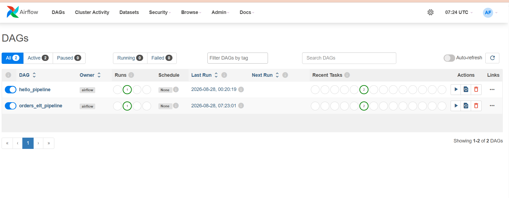
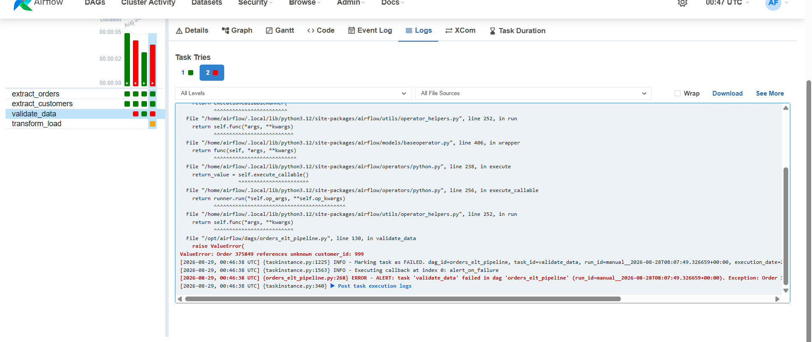
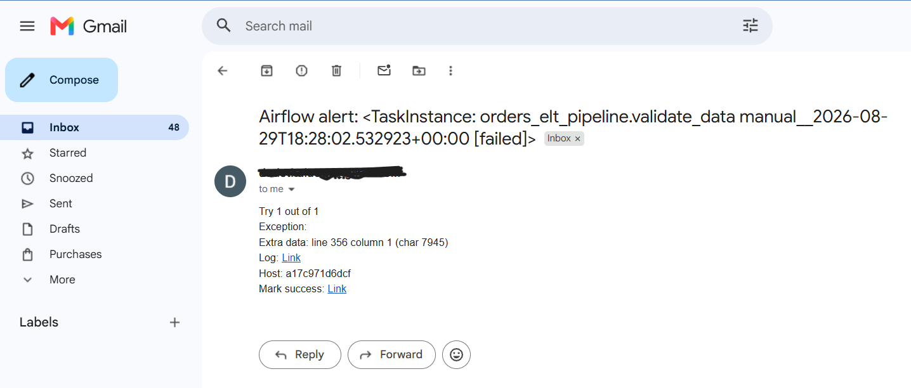
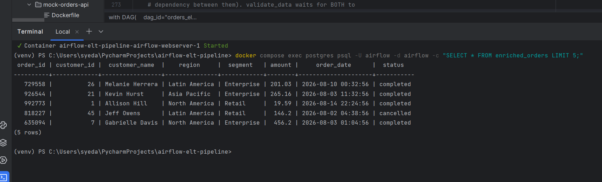
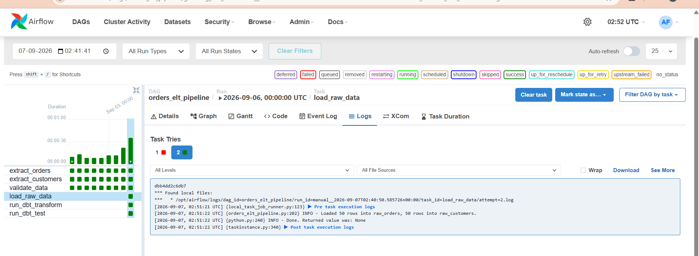
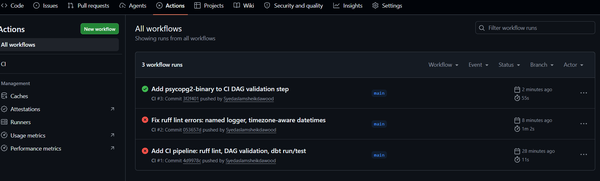

# Orders ELT Pipeline (Apache Airflow + dbt)

An end-to-end ELT pipeline built with Apache Airflow that extracts order data from a live API and a static customer reference file, validates it against a strict data-quality gate, loads it into Postgres, transforms it with dbt, and sends real email alerts on failure. Every push is automatically linted, DAG-validated, and tested via GitHub Actions.


This project simulates a realistic small-scale data engineering scenario: a fast-moving transactional feed (orders) joined against a slow-changing reference dataset (customers), with the kind of data-quality, transformation, and CI practices expected in production pipelines.

## Architecture

```
┌────────────────────┐        ┌──────────────────────┐
│  Mock Orders API    │        │   customers.csv      │
│  (FastAPI service)  │        │  (static reference)  │
└──────────┬───────────┘        └──────────┬────────────┘
           │                                │
           ▼                                ▼
    extract_orders                 extract_customers
           │                                │
           └───────────────┬────────────────┘
                            ▼
                     validate_data
                (strict fail on bad data)
                            │
                            ▼
                     load_raw_data
              (pure extract-and-load, no
               transformation — into
               raw_orders / raw_customers)
                            │
                            ▼
                   run_dbt_transform
              (dbt run — joins + aggregates
               into enriched_orders and
               revenue_by_region)
                            │
                            ▼
                     run_dbt_test
              (dbt test — not_null / unique
               checks on both models)

  Any task failure anywhere in the DAG triggers:
    - a structured log alert (on_failure_callback)
    - a real email notification (SMTP)

  Every push to GitHub triggers:
    - ruff lint on all Python
    - Airflow DAG import validation
    - dbt run + test against a fresh, ephemeral Postgres
```

## Tech Stack

- **Orchestration:** Apache Airflow 2.10 (LocalExecutor), Docker Compose, a custom Airflow image (`Dockerfile.airflow`) with dbt baked in
- **Transformation:** dbt-postgres 1.11.0 (dbt-core 1.12.3) — models + schema tests
- **Mock upstream source:** FastAPI + Faker (simulates a live orders API)
- **Storage:** PostgreSQL
- **Language:** Python (requests, psycopg2, csv, json)
- **Alerting:** Airflow's built-in SMTP integration (Gmail)
- **CI/CD:** GitHub Actions (ruff, DAG import validation, dbt run/test)

## Key Features

- **Two independent source types, joined downstream** — a live, randomly-generated "orders" feed (API) and a static "customers" reference file (CSV), mirroring a common real-world fact/dimension pattern.
- **Strict data-quality gate.** `validate_data` checks for missing fields, duplicate order IDs, referential integrity (every order's `customer_id` must exist in the customer file), invalid amounts, and unparseable dates. Any failure raises an exception and **stops the pipeline** — bad data never reaches the load stage.
- **Transformation logic lives in dbt, not the orchestrator.** `load_raw_data` does a pure extract-and-load into raw tables; dbt models (`enriched_orders.sql`, `revenue_by_region.sql`) own the join and aggregation, with `schema.yml` declaring `not_null`/`unique` tests against the output — kept as a separate Airflow task (`run_dbt_test`) from the transform step, so a failed data-quality check is visually distinct from a broken transform in the Grid view.
- **Idempotent loads.** Both the raw load and the dbt models fully refresh on every run, so re-running the DAG never creates duplicate rows.
- **Automatic failure alerting on every task**, wired once at the DAG level via `default_args` rather than repeated per task:
  - A structured log message (`on_failure_callback`) — the extensible hook point for Slack/PagerDuty/etc.
  - A real email sent via Gmail SMTP (`email_on_failure`), confirmed working end-to-end.
- **Scheduled to run autonomously** (daily), not just on manual trigger.
- **CI on every push.** GitHub Actions lints the code, validates that Airflow can actually import the DAG, and runs the real `dbt run`/`dbt test` commands against a disposable Postgres service container — catching broken code before it ever reaches a real run. This is intentionally CI (checking every change), not full CD — the `dbt-test` job verifies transformation logic in isolation with fixture data, rather than spinning up the entire Airflow stack inside every CI run.

## Project Structure

```
airflow-elt-pipeline/
├── .github/
│   └── workflows/
│       └── ci.yml                 # lint, DAG validation, dbt run/test
├── dags/
│   ├── hello_pipeline.py          # initial sanity-check DAG
│   └── orders_elt_pipeline.py     # main ELT pipeline
├── data/
│   └── customers.csv              # static reference dataset
├── dbt_profiles/
│   └── profiles.yml               # container-internal dbt connection config
├── orders_dbt/
│   └── models/
│       ├── sources.yml            # declares raw_orders / raw_customers
│       ├── enriched_orders.sql    # join model
│       ├── revenue_by_region.sql  # aggregate model
│       └── schema.yml             # not_null / unique tests
├── mock-orders-api/
│   ├── main.py                    # FastAPI app serving fake orders
│   ├── requirements.txt
│   └── Dockerfile
├── logs/
├── plugins/
├── .env                           # SMTP credentials (not committed)
├── .gitignore
├── Dockerfile.airflow             # custom Airflow image with dbt installed
└── docker-compose.yaml
```

## Setup & Running Locally

**Prerequisites:** Docker Desktop, Python 3.12+ (for local editing only — the pipeline itself runs entirely in containers).

1. Clone the repo and `cd` into it.
2. Create a `.env` file in the project root with:
   ```
   SMTP_EMAIL=your-alerts-account@gmail.com
   SMTP_APP_PASSWORD=your16charapppassword
   ```
   (Requires a Gmail account with 2-Step Verification enabled and an [App Password](https://myaccount.google.com/apppasswords) generated for this project.)
3. Build and start the stack (the build step compiles the custom Airflow image with dbt installed):
   ```
   docker compose up -d --build
   ```
4. Open the Airflow UI at [http://localhost:8081](http://localhost:8081) (login: `airflow` / `airflow`).
5. Unpause `orders_elt_pipeline` and trigger it manually, or let it run on its daily schedule.
6. Inspect results directly in Postgres:
   ```
   docker compose exec postgres psql -U airflow -d airflow -c "SELECT * FROM enriched_orders LIMIT 5;"
   docker compose exec postgres psql -U airflow -d airflow -c "SELECT * FROM revenue_by_region ORDER BY total_amount DESC;"
   ```

## Validation & Alerting — Proven, Not Just Claimed

This pipeline's failure handling and transformation logic were deliberately tested, not just written and assumed to work:

- **Negative test:** manually corrupted `raw_orders.json` with an unknown `customer_id`, confirming `validate_data` fails loudly with a clear exception and the DAG halts before loading bad data.
- **Alerting test:** confirmed the same failure produced both a structured log alert and a real email notification, delivered to an inbox within seconds.
- **dbt models verified working:** the join and aggregation were confirmed correct against real loaded data, with `dbt test` passing both locally and — separately — against a completely fresh Postgres instance in CI.
- **CI has a real history, not a staged one.** The first two CI runs on this pipeline failed for real reasons (a batch of pre-existing lint issues, then a missing `psycopg2-binary` dependency for the DAG-validation step) before the third run passed clean — visible directly in the [Actions tab](https://github.com/Syedaslamsheikdawood/airflow-elt-pipeline/actions).

*(Screenshots below)*

### Screenshots

**Successful pipeline run (all tasks green)**


**`validate_data` failing intentionally on bad data**


**Real failure alert email received**


**Query results from `enriched_orders` and `revenue_by_region`**


**dbt transform and test tasks succeeding in the Airflow UI**


**CI pipeline passing on GitHub Actions**


## What I'd Improve Next

- Swap the strict-fail validator for a **quarantine pattern** — route bad records to a dead-letter table for inspection instead of halting the whole batch.
- Add incremental/CDC-style loading instead of full truncate-and-reload, once data volumes justify it.
- Add Slack notifications alongside email, to demonstrate the alerting hook is genuinely pluggable.
- Add `dbt` documentation generation (`dbt docs generate`) for a browsable model lineage graph.
- Extend CI toward light CD — e.g., automatically publishing dbt docs, or running a full Docker Compose–based integration test of the real DAG, not just the transformation layer in isolation.